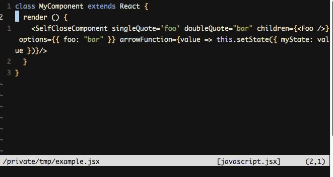
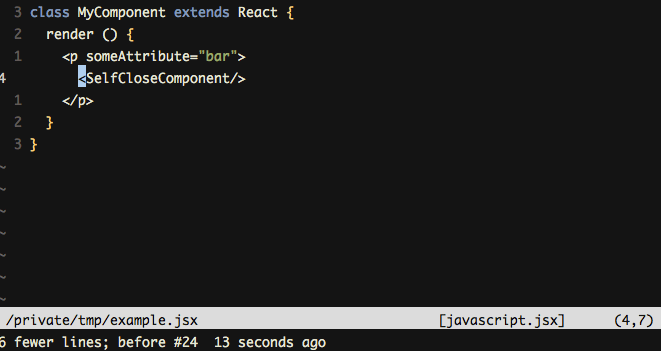
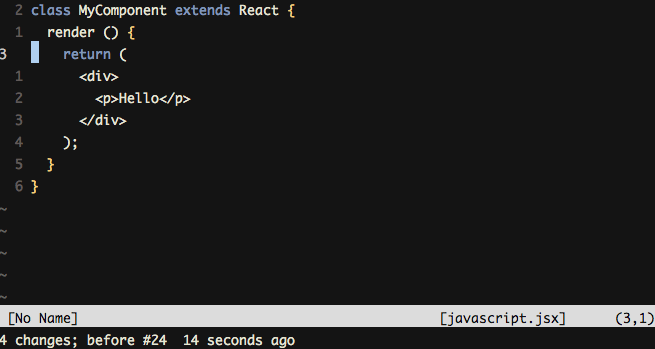

# vim-jsx-utils
Plugin with some utilities to folks who work with **[JSX](https://facebook.github.io/jsx/)** on Vim.

:warning: This plugin only expose a [set of functions](#functions). You need create your own mappings to this, like:

```
nnoremap <leader>ja :call JSXEncloseReturn()<CR>
nnoremap <leader>ji :call JSXEachAttributeInLine()<CR>
nnoremap <leader>je :call JSXExtractPartialPrompt()<CR>
nnoremap <leader>jc :call JSXChangeTagPrompt()<CR>
nnoremap vat :call JSXSelectTag()<CR>
```

:warning: All functions must be invoked on the first component line.

## Installation
You can install this plugin with [Pathogen](https://github.com/tpope/vim-pathogen), [Vundle](https://github.com/VundleVim/Vundle.vim) and other plugin loaders.

## Functions

### JSXSelectTag
Select the whole tag, like `vat`, but with a little improvement to select self-closing tags.

### JSXEncloseReturn
Put the current tag on a return statement with parenthesis.


### JSXEachAttributeInLine
Put each tag attribute's on its own line to better readability.



### JSXExtractPartialPrompt
:warning: Only ES6 classes

Extract some tag on its own method on a ES6 class.



### JSXChangeTagPrompt

Change the tag name



-------
Samuel Simões ~ [@samuelsimoes](https://twitter.com/samuelsimoes) ~ [Blog](http://blog.samuelsimoes.com/)
